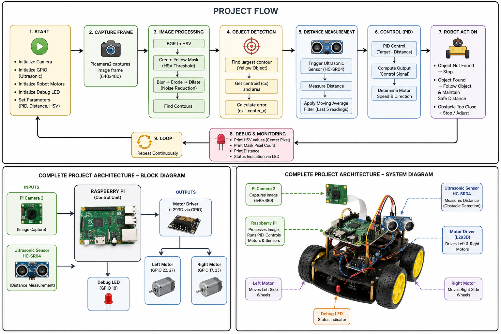

# 🎯 Vision-Based Object Tracking System

A real-time **Vision-Based Object Tracking System** built using **Raspberry Pi**, **OpenCV**, **Pi Camera**, **HC-SR04 Ultrasonic Sensor**, and **PID Control**. The system detects and tracks a target object while maintaining a safe following distance autonomously.

---

## 📌 Project Overview

This project combines **computer vision**, **distance sensing**, and **motion control** to create an autonomous tracking robot capable of:

- Detecting target objects using camera vision
- Tracking object movement in real-time
- Maintaining safe distance automatically
- Controlling motor speed using PID
- Stopping safely when the object is lost

---

## 🚀 Features

✅ Real-time object detection and tracking

✅ HSV-based color segmentation

✅ Distance measurement using HC-SR04

✅ PID-based motor control

✅ Differential drive movement

✅ Moving average filtering for stable readings

✅ Automatic stop when target is lost

---

## 🛠 Hardware Used

| Component | Description |
|-----------|-------------|
| Raspberry Pi 4B | Main processing unit |
| Pi Camera Module | Image capture |
| HC-SR04 Ultrasonic Sensor | Distance measurement |
| L298N Motor Driver | Motor control |
| DC Motors | Robot movement |
| Battery Pack | Power supply |

---

## 💻 Software Stack

- Python
- OpenCV
- Raspberry Pi GPIO
- NumPy
- PID Control Algorithm
- HSV Color Detection

---

## ⚙ System Workflow

```text
Start
   ↓
Capture Camera Frame
   ↓
Convert Image → HSV
   ↓
Apply Yellow Mask
   ↓
Detect Object Contours
   ↓
Calculate Object Position
   ↓
Measure Distance (Ultrasonic)
   ↓
Apply Moving Average Filter
   ↓
PID Control
   ↓
Motor Adjustment
   ↓
Robot Movement
```

---

## 📷 Object Detection Method

The system uses:

1. Capture frame from Pi Camera
2. Convert image from RGB → HSV
3. Apply yellow color threshold
4. Perform erosion and dilation
5. Detect contours
6. Extract centroid position
7. Calculate tracking error
8. Control robot direction

---

## 📏 Distance Control

Distance is measured using **HC-SR04 ultrasonic sensor**.

Features:

- Safe following distance: **30 cm**
- Moving average filter window: **5 samples**
- Noise reduction
- Stable tracking performance

---

## 🤖 Robot Behaviour

### Object Detected

- Move forward
- Adjust direction
- Maintain distance

### Object Lost

- Stop motors
- Wait for object reappearance

### Object Too Close

- Reduce speed
- Stop if required

---

## 📂 Project Structure

```bash
Vision-Based-Object-Tracking-System/
│── Codes/
│   ├── Color_detect_HSV.py -- Used to read the HSV values for the required color (Yellow is our case).
│   ├── HSV.py -- Read the HSV values and print them.
│   └── Tracker.py -- Main code file
│
│── images/
│── README.md
```

<!--## 🔧 Installation

Clone repository:

```bash
git clone https://github.com/yourusername/Vision-Based-Object-Tracking-System.git
```

Move into project:

```bash
cd Vision-Based-Object-Tracking-System
```

Install dependencies:

```bash
pip install -r requirements.txt
```

Run project:

```bash
python Tracker.py
```
--->

---

## 📈 Results

- Maintained **30 cm** safe distance
- Real-time object detection
- Smooth tracking using PID
- Full horizontal tracking capability
- Stable distance filtering

---

## 🔮 Future Improvements

- Multi-object tracking
- YOLOv8 integration
- Obstacle avoidance
- ROS2 integration
- Cloud telemetry dashboard
- Battery optimization

---

## 📸 Hardware Setup

Components connected:

Raspberry Pi 4B  
↓  
Pi Camera Module  
↓  
HC-SR04 Sensor  
↓  
L298N Motor Driver  
↓  
Differential Drive Robot



---

## 👨‍💻 Authors

**D Mabu Jaheer Abbas** 

**Narra Raghuvender**

---

## 📜 License

This project is developed for educational and research purposes.

MIT License
